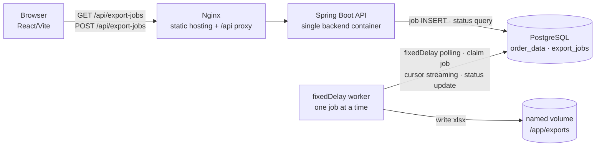

# 비동기 Excel Export

Playstory 사전 과제를 구현한다. 사용자가 엑셀 생성을 요청하면 즉시 응답하고, backend worker가 과제 명세의 주문 데이터 10만 건을 XLSX 파일로 생성한다.

## 실행

### 요구 환경

- Docker Desktop 또는 Docker Engine + Docker Compose v2
- 외부 계정·외부 서비스는 사용하지 않는다.

### 시작

```bash
docker compose up --build
```

초기 실행에서는 PostgreSQL schema와 10만 건 시드를 Flyway migration으로 자동 생성한다. 이후 브라우저에서 아래 주소로 접속한다.

| 용도 | 주소 |
|---|---|
| **프론트엔드 화면** | [http://localhost:8088](http://localhost:8088) |
| backend API | `http://localhost:8088/api/export-jobs` |

화면에서 **새 엑셀 생성 요청** 버튼을 누르면 job을 생성하고 상태를 2초 간격으로 갱신한다. `done` 상태가 되면 다운로드 링크로 XLSX 파일을 내려받는다.

### 종료

```bash
docker compose down
```

이 명령은 컨테이너만 종료한다. PostgreSQL과 생성 파일은 named volume에 남으므로 다음 실행에서도 유지한다.

## 과제 요구사항 대응

| 요구사항 | 구현 |
|---|---|
| 즉시 응답·백그라운드 생성 | `POST /api/export-jobs`가 job을 저장한 뒤 `202 Accepted`를 반환하고, scheduler worker가 별도 흐름에서 처리한다. |
| job 상태 | `pending / processing / done / failed`를 `export_jobs` 테이블에 영속화한다. |
| 시작·완료 시각·파일 경로 | `requested_at`, `started_at`, `finished_at`, `logical_file_path`를 저장한다. |
| 10만 건 자동 시드 | Flyway migration에서 PostgreSQL `generate_series`로 생성한다. |
| 컨테이너 로컬 파일 저장 | backend named volume의 `/app/exports`에 저장한다. |
| 데이터 요청 목록 화면 | React 화면에서 job ID·요청/시작/완료 시각·상태·파일 경로·다운로드를 제공한다. |
| 단일 backend 컨테이너·고정 자원 | Compose의 backend에 CPU `0.5`, 메모리 `1G`, reservation CPU `0.25`, 메모리 `512M`를 명시한다. |

시드 테이블은 과제 명세의 `id`, `user_name`, `product_name`, `category`, `amount`, `status`, `order_date` 컬럼을 사용한다.

## 아키텍처



- `frontend`: React 결과물을 Nginx가 제공하고 `/api` 요청을 backend로 proxy한다.
- `backend`: Spring Boot 단일 컨테이너로 구성한다. API는 짧게 끝내고 worker가 파일 생성을 수행한다.
- `postgres`: 주문 데이터와 job 상태를 함께 저장한다.
- `exports_data`: 생성 XLSX를 backend 재시작 뒤에도 유지한다.

## 패키지 구조

과제의 단일 `ExportJob` 도메인에 맞춰, 전체 계층을 과도하게 늘리지 않은 경량 Hexagonal 구조를 적용한다.

```text
com.playstory.excel
├── config
└── export
    ├── domain
    │   └── ExportJob, JobStatus
    ├── application
    │   └── ExportJobProcessor
    │       # 상태 전이·파일 정합성 보정·실패 처리 흐름 조율
    ├── port
    │   ├── ExportJobStore
    │   ├── ExcelFileExporter
    │   └── ExportFileStorage
    ├── infrastructure
    │   ├── persistence/JdbcExportJobRepository
    │   ├── file/JdbcStreamingExcelExporter, LocalExportFileStorage
    │   └── scheduling/ExportJobPollingScheduler
    └── presentation
        └── ExportJobController, ExportJobResponse, ApiExceptionHandler
```

`application`은 domain과 port에만 의존한다. Spring scheduler·설정값·로그는 `infrastructure.scheduling` adapter로 분리하고, API 응답은 `presentation`의 `ExportJobResponse` DTO로 변환한다. PostgreSQL/JDBC, Apache POI, 로컬 파일시스템 구현은 `infrastructure`에 격리한다.

## 핵심 흐름과 상태 전이

```text
POST 요청
  → export_jobs INSERT (PENDING)
  → 202 Accepted
  → worker가 원자적으로 선점 (PROCESSING, lease 설정)
  → JDBC cursor streaming + SXSSF로 .tmp/{jobId}.xlsx 생성
  → 최종 경로 이동·ZIP 검증
  → DONE + logical file path 기록
```

실패하면 `FAILED`와 오류 요약을 기록한다. worker가 비정상 종료돼 `PROCESSING`에 남으면 lease 만료 후 `PENDING`으로 복구해 처음부터 다시 생성한다. 파일 이동은 성공했지만 DB 완료 기록 전에 종료된 경우에는 다음 기동 시 최종 XLSX 파일을 검증해 `DONE`으로 보정한다.

## 기술 스택 선택 이유와 설계 시 고민한 점

| 결정 | 고려한 대안 | 선택 이유 | 현재 한계·확장 방향 |
|---|---|---|---|
| **Spring Boot + Java 21** | FastAPI | JDBC transaction, scheduler, 오류 처리와 테스트 구조를 명시적으로 보여 주기 좋고, Java backend 경험을 직접 설명할 수 있다. | JVM 메모리 부담이 있어 streaming과 단일 worker로 제어한다. |
| **PostgreSQL** | MySQL, SQLite | `generate_series`, `FOR UPDATE SKIP LOCKED`, `RETURNING`으로 10만 건 시드와 job 원자 선점을 간결하게 구현할 수 있다. | 별도 DB 컨테이너가 필요하다. |
| **DB job queue + 단일 scheduled worker** | 요청 thread에서 생성, `@Async`, Spring Batch, Kafka/RabbitMQ | 요청과 대용량 생성을 분리하면서 상태·실패·재시작 복구를 DB에 남긴다. 외부 서비스 없이 단일 backend 제약에 맞는다. | polling 지연과 대기열이 생길 수 있다. job 유형·처리량이 커지면 Spring Batch 또는 worker 분리를 검토한다. |
| **JDBC cursor + Apache POI SXSSF** | JPA `findAll`, 일반 `XSSFWorkbook`, CSV | 모든 행을 heap에 적재하지 않고 일정 행 window만 유지해 1GB 제약에서 XLSX를 생성한다. | JPA보다 구현이 길고 JDBC fetch size·transaction을 이해해야 한다. |
| **2초 polling** | 수동 새로고침, SSE | 목록 API를 재사용해 구현과 재연결 처리가 단순하다. | 완료 반영이 최대 2초 늦다. 실시간 요구가 커지면 SSE를 도입한다. |
| **로컬 named volume** | S3 등 객체 스토리지 | 외부 계정·서비스 없이 Compose만으로 완결된다. | 다중 인스턴스·장기 보존에는 맞지 않아 객체 스토리지와 lifecycle 정책으로 확장한다. |

### Outbox와 CQRS를 기본 구조로 두지 않은 이유

- **Outbox**는 DB 변경과 Kafka·알림 같은 외부 이벤트 발행의 이중 쓰기를 해결할 때 효과적이다. 여기서는 `export_jobs` INSERT 자체가 durable queue이고 worker가 같은 DB를 polling하므로 별도 메시지 발행이 없다. DB와 파일시스템 경계는 Outbox가 해결하지 못하므로, 임시 파일·검증·reconcile로 다룬다.
- **CQRS**는 Command(`POST`, worker 상태 전이)와 Query(목록, 다운로드)를 논리적으로 분리했다. 하지만 조회 필드가 job 테이블의 소수 컬럼뿐이라 read DB·projection을 따로 두면 projection 지연과 운영 비용만 늘어난다. 운영 대시보드·대량 이력 조회가 커질 때 read model을 분리한다.

## 장애 대응

| 상황 | 현재 처리 |
|---|---|
| backend 종료 중 처리 | `lease_until` 만료 후 `PROCESSING → PENDING`으로 복구 |
| 파일 생성·이동 실패 | 최종 경로를 기록하지 않고 `FAILED`와 오류 코드 저장 |
| 파일은 있으나 DB 완료 기록 전 종료 | 다음 기동의 reconcile이 유효 XLSX를 확인해 `DONE` 보정 |
| `DONE`인데 파일 유실·손상 | 다운로드 시 파일을 다시 검증하고 `FILE_NOT_FOUND` 계열 오류를 반환 |
| DB 일시 장애 | API 요청은 `503`, worker는 다음 실행에서 다시 DB 연결을 시도 |
| 미완료 job 다운로드 | 파일 대신 `409 JOB_NOT_COMPLETED` 반환 |

## 버전 고정

Spring Boot parent는 `3.4.5`로 고정해 Spring framework·test starter의 호환 버전을 BOM으로 관리한다. 직접 사용하는 라이브러리는 다음처럼 명시한다.

| 구성요소 | 버전 |
|---|---|
| Java | 21 |
| Flyway core / PostgreSQL module | 10.20.1 |
| PostgreSQL JDBC | 42.7.13 |
| Apache POI | 5.5.1 |
| PostgreSQL container | 16.14-alpine + digest |
| Maven build container | 3.9.9 + Eclipse Temurin 21 + digest |
| runtime JRE | Eclipse Temurin 21.0.12.1 + digest |
| Node build container | 24.17.0-alpine + digest |
| Nginx | 1.27.5-alpine + digest |

Docker base image에는 태그뿐 아니라 multi-architecture manifest digest도 함께 고정한다. 같은 Dockerfile이 시간에 따라 다른 이미지를 받지 않게 한다.

## 검증 결과


<br>

로컬 Docker Compose 환경에서 확인한다.

- backend Docker build 중 단위 테스트 통과를 확인한다.
- Flyway migration 2개와 주문 데이터 100,000건 생성을 확인한다.
- API 요청은 `202 Accepted`로 즉시 응답한다.
- 완료된 4개 job의 `시작 시각 → 완료 시각` 기준 생성 시간은 **14초, 12초, 11초, 7초**이며 평균 **11.0초**를 기록한다.
- 단일 backend 컨테이너(CPU 0.5, 메모리 1GB), PostgreSQL·named volume을 포함한 로컬 Docker Compose 환경에서 100,000행 XLSX를 생성한다.
- 100,000행 생성 job이 `done`으로 전이하고 XLSX 다운로드가 `200 OK`로 응답함을 확인한다.
- 내려받은 XLSX는 헤더 포함 **100,001행**이며 파일 크기는 **3,884,470 bytes**로 확인한다.

## 후속 개선 방향

1. queue wait time, job duration, JVM heap·GC, DB connection, volume 사용량을 지표로 기록한다.
2. 실제 대기열 증가가 확인되면 worker를 별도 서비스로 분리하고 동시성을 측정 기반으로 조절한다.
3. 대용량 파일 보존·다중 인스턴스가 필요해지면 객체 스토리지와 lifecycle 정책을 도입한다.
4. 알림·감사 로그·후속 소비자가 생기면 Outbox를, 복잡한 운영 조회가 생기면 CQRS read model을 단계적으로 도입한다.
5. 사용자 인증, 실패 job 제한 재시도, idempotency key, 완료 파일 보존 기간 정책을 추가한다.
